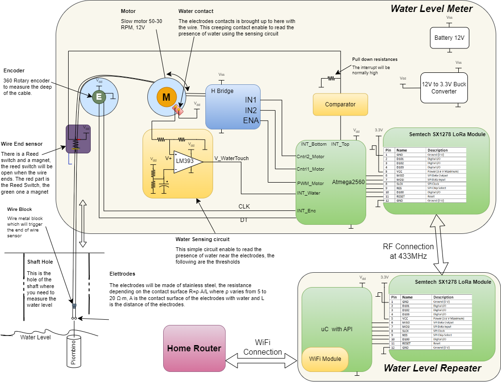

# WellMeter
Design of a machine to measure the depth of a well.

## Current status
The project is in step 1, i'm designing the 3d printed part to handle the electrodes and the weight.

## The problem
We need to measure the depth of a shared well constantly in order to know the water level and avoid that the 120 user of the waterworks are without water.

## The constraints
These are the main constraints of the project:

- The well is 24 meters deep.
- The water level can vary from 17 to 14 meters deep but it is mainly unknown at the beginning.
- The well has a circlo open on the top of about 2cm of diameter where the sensor can be dropped.
- There is no internet connection in the well.
- The well is 1km away from my house without big obstacles in between.
- We need regular updates of the water level in the well, at least one per hour, more is better.

## Sensor Solutions evaluation
These are the possible solution for the water meter sensor:

- **Ultrasonic sensor**: It is a sensor that measures the distance to an object by sending a sound wave and measuring the time it takes for the sound wave to bounce back. This solution is discarded because the commercial sensors reach only 5-6 meters of range (we need 15m).
- **Laser sensor**: It is a sensor that measures the distance to an object by sending a laser beam and measuring the time it takes for the laser beam to bounce back. This solution is discarded because the reflection of the laser beam in the water can be distorted.
- **Pressure sensor**: It is a sensor that measures the pressure of the water column above it. This solution is discarded because the idrostatic pressure can change when the pump is working.
- **Radar sensor**: It is a sensor that measures the distance to an object by sending a radar wave and measuring the time it takes for the radar wave to bounce back. This solution is discarded because the opening of the well is too small for the radar sensor.

The proposed solution is two electrodes connected to a weight that are lowered into the well, the resistance measurement between the electrodes detects the presence of water.

## Design
This is the architecture design of the well meter:

### Step 1
For the step 1 i will make a POC with the electrodes and the sensing circuit, the electrodes are connected to a weight that is lowered into the well, the comparator output will be connected to a led to show the presence of water. If this POC works we can go to the next step.

In order to do the poc we need the following parts:
    - A 24m of 2 wire cable (the same i will use then in the final version)
    - A 3d printed part to handle the electrodes and connect the weight to the wire.
    - The comparator circuit with the led.

For the 3d printed part i will use FreeCad to design it.

During the step 1 i will develop in parallel:

- The mechanical parts to handle the final version using freecad.
- Component selection for the final version.
